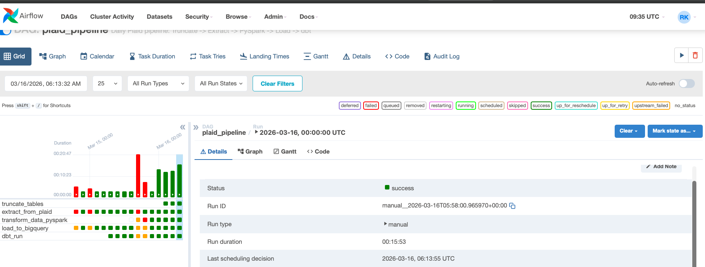
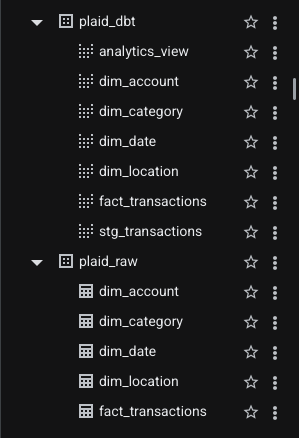
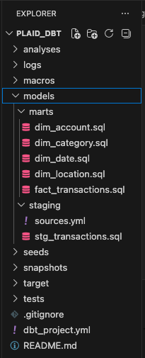
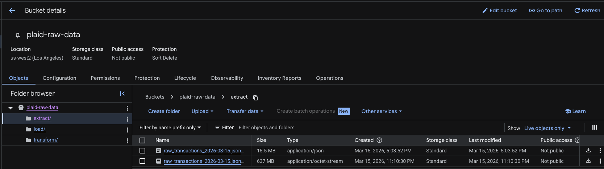

# Plaid Analytics — End-to-End Data Engineering Pipeline

> **Live Dashboard:** [Looker Studio Dashboard](URL)

The Looker Studio dashboard connects directly to `plaid_dbt.analytics_view` in BigQuery and refreshes automatically when the pipeline runs.


---

## Overview

**A full-stack financial data pipeline — from Plaid API to production-ready analytics. Built with PySpark, BigQuery, dbt, and Airflow.**
---

## Architecture

```
Plaid API (Sandbox)
    │
    ▼
Python Extract + Faker Generator (500,000 transactions)
    │
    ▼
Google Cloud Storage — Raw Layer (JSONL)
    │
    ▼
Apache Spark (PySpark) — Transform Layer
    │
    ▼
Google Cloud Storage — Parquet Layer
    │
    ▼
BigQuery — plaid_raw (Star Schema)
    │
    ▼
dbt — plaid_dbt (Business Logic + Views)
    │
    ▼
Looker Studio — Analytics Dashboard
```

All steps are orchestrated and scheduled daily by **Apache Airflow**.

---

## Tech Stack

| Layer | Tool |
|---|---|
| Data Source | Plaid API (Sandbox) |
| Orchestration | Apache Airflow 2.7 |
| Processing | Apache Spark 3.4 (PySpark) |
| Data Lake | Google Cloud Storage |
| Data Warehouse | Google BigQuery |
| Transformation | dbt (dbt-bigquery 1.11) |
| Dashboard | Looker Studio |
| Language | Python 3.11 |

---

## Pipeline Tasks



The Airflow DAG runs 5 tasks in sequence every day:

### Task 1 — Truncate Tables
Clears all BigQuery tables before each run to prevent duplicate data from retries or re-runs.

### Task 2 — Extract
- Connects to the **Plaid Sandbox API** and pulls up to 500 real financial transactions
- Generates **500,000 synthetic transactions** using Faker across 27 merchant categories
- Distributes transactions across **5 account owners** with unique account IDs
- Saves as **newline-delimited JSON (.jsonl)** and uploads to GCS with a 10-minute timeout

### Task 3 — Transform (PySpark)
- Reads raw JSONL from GCS into a Spark DataFrame
- Flattens nested JSON fields (`personal_finance_category`, `location`)
- Fills null location fields with realistic NYC borough data using native Spark functions
- Adds date dimension columns (`year`, `quarter`, `month`, `day_of_week`)
- Saves output as **Parquet** back to GCS

### Task 4 — Load
- Downloads Parquet parts from GCS
- Deduplicates on `plaid_transaction_id`
- Builds a **star schema** with 1 fact table and 4 dimension tables
- Loads all 5 tables to BigQuery with `WRITE_TRUNCATE`

### Task 5 — dbt Run
- Rebuilds all **6 dbt views** in the `plaid_dbt` dataset
- Applies business logic transformations fresh every run

---

## Data Model

### Raw Layer — `plaid_raw`

Star schema loaded by the Python/Spark pipeline:

```
fact_transactions
    ├── dim_account
    ├── dim_date
    ├── dim_category
    └── dim_location
```

| Table | Description |
|---|---|
| `fact_transactions` | Core transaction records with foreign keys |
| `dim_account` | Account owner information (5 owners) |
| `dim_date` | Date dimensions (year, quarter, month, day) |
| `dim_category` | Plaid personal finance categories |
| `dim_location` | NYC borough location data |



### Transformation Layer — `plaid_dbt`

dbt views built on top of `plaid_raw`:

| Model | Description |
|---|---|
| `stg_transactions` | Staging model — cleans and standardizes raw data |
| `fact_transactions` | Final fact table joined to all dimensions |
| `dim_account` | Cleaned account dimension |
| `dim_category` | Cleaned category dimension with proper casing |
| `dim_date` | Cleaned date dimension |
| `dim_location` | Cleaned location dimension |
| `analytics_view` | Fully denormalized analytics-ready view |



---

## dbt Transformations

All business logic is handled in dbt — not in Python — keeping the raw layer clean and transformations version controlled:

| Field | Transformation |
|---|---|
| `days_since_transaction` | Recalculated fresh every run from `current_date()` |
| `pending` | `Yes` / `No` based on whether transaction date equals today |
| `is_large_transaction` | `Yes` if `amount_usd > $1,000` |
| `amount_bucket` | Spending tiers: Under $10, $10-$50, $50-$100, $100-$500, Over $500 |
| `transaction_direction` | `Debit` / `Credit` based on amount sign |
| `category_primary` | Proper case formatting (`FOOD_AND_DRINK` → `Food And Drink`) |
| `category_detail` | Proper case formatting |
| `payment_channel` | Proper case formatting |
| `country` | `US` → `USA` |

---

## Data

### Account Owners (5 users)

| Owner | Account ID |
|---|---|
| John Doe | oM4wKDvbaDUwBAZEz17eSkqElAjJMXToM1q5x |
| Sarah Johnson | LLvqdaJMXaSqMpjnJ96eSyZ5LJa9ArCkQqjKd |
| Marcus Williams | p1NWrDvg4Did3BLV7DmjcE8W4ky9rpcprbojm |
| Emily Chen | MpvKa4JlX4UBNgGWEDXmFKVr7vyDJACLlN6pm |
| David Rodriguez | 1bd9oVQJ8VU8XjWeGkN9SdvLNyA1m3upKNjXV |

### Merchant Categories (27 merchants)

Food & Drink, General Merchandise, Entertainment, Travel, Transportation, Personal Care, Rent & Utilities, Income, Loan Payments

### Volume

| Metric | Value |
|---|---|
| Total Transactions | ~500,200 per run |
| Real Plaid Transactions | ~200 |
| Synthetic Transactions | 500,000 |
| Date Range | Rolling 365 days |
| Unique Merchants | 27 |

---

## Project Structure

```
Plaid_Analytics/
├── Airflow-ETL/
│   ├── plaid_pipeline_dag.py     ← Main Airflow DAG (5 tasks)
│   └── Airflow-ETL.png           ← Pipeline screenshot
├── BigQuery/
│   ├── DW_Analytics_Create_View.sql  ← Analytics view SQL
│   └── BigQueryTables.png            ← BigQuery schema screenshot
├── GCS/
│   └── Google_Cloud_Raw_Data.png     ← GCS bucket screenshot
├── Looker Dashboard/
│   └── URL                           ← Dashboard link
├── dbt/tables/
│   ├── stg_transactions.sql
│   ├── fact_transactions.sql
│   ├── dim_account.sql
│   ├── dim_category.sql
│   ├── dim_date.sql
│   ├── dim_location.sql
│   └── dbt.png                       ← dbt run screenshot
└── README.md
```

---

## Setup

### Prerequisites

- Python 3.11
- Java 11 (OpenJDK)
- Apache Airflow 2.7
- Google Cloud account with BigQuery and GCS enabled
- Plaid developer account (free sandbox)

### Installation

```bash
# Create conda environment
conda create -n airflow_env python=3.11
conda activate airflow_env

# Install dependencies
pip install apache-airflow
pip install plaid-python
pip install google-cloud-storage
pip install google-cloud-bigquery
pip install pyspark==3.4.0
pip install dbt-bigquery
pip install faker
pip install "numpy<2.0"

# Set Java home
export JAVA_HOME=$(brew --prefix openjdk@11)

# Initialize Airflow
airflow db init
airflow users create --username admin --password admin --role Admin --firstname Admin --lastname Admin --email admin@example.com
```

### Configuration

1. Add Plaid credentials to Airflow Variables:
   - `PLAID_CLIENT_ID`
   - `PLAID_SECRET`

2. Set up GCP authentication:
```bash
gcloud auth application-default login
```

3. Initialize dbt:
```bash
dbt init plaid_dbt
```

4. Update `~/.dbt/profiles.yml` with your BigQuery project and `us-west2` location

### Running the Pipeline

```bash
# Start Airflow
airflow webserver --port 8080
airflow scheduler

# Trigger manually at http://localhost:8080
# DAG ID: plaid_pipeline
```

---

## GCS Bucket Structure

```
plaid-raw-data/
├── extract/
│   └── raw_transactions_YYYY-MM-DD.jsonl    ← Raw Plaid + synthetic data
├── transform/
│   └── plaid_transform_YYYY-MM-DD_partN.parquet  ← Spark output
└── load/
    ├── fact_transactions_YYYY-MM-DD.parquet
    ├── dim_account_YYYY-MM-DD.parquet
    ├── dim_location_YYYY-MM-DD.parquet
    ├── dim_category_YYYY-MM-DD.parquet
    └── dim_date_YYYY-MM-DD.parquet
```



---

---

*Built by Ramiz Khatib*
